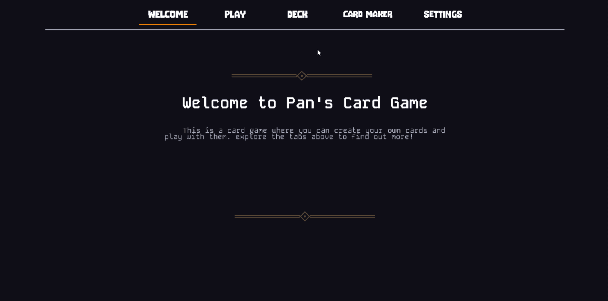

# Pan's Card

***

***

WIP Project

***

- Duration:             1 year
- Language:             C++
- Key words:            Gameplay, UI, Networking, System Architecture
- Platform:             Steam
- Engine:               Custom Engine
- Time:                 August 2023 - May 2024

***

Pan's Card is a hearthstone-like project where you can duel with other player over LAN and customize cards with Lua. 

***

### Key features

1. Gameplay like <a href="hearthstone.blizzard.com">Hearthstone</a>
2. Custom UI Framework
3. Customizable Cards
4. Interated Lua source code into engine
5. TCP Networking with state sync

***
