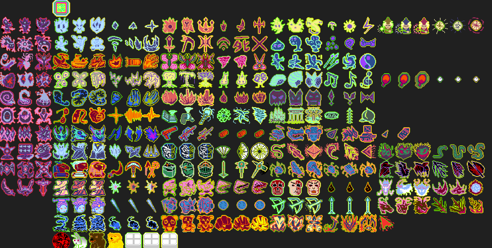

# Pan's Survivor Chess

***

captured during development

***

    
<a href="https://store.steampowered.com/app/2484610/">Steam Store Page</a>

***

- Duration:             2 months
- Language:             C++
- Key words:            Gameplay
- Platform:             Steam
- Engine:               Custom Engine
- Time:                 May 2024 - July 2023

***

This project is made during the summer term of SMU Guidlhall program. Roughly 90 hours were put into this project while 4 other classes were going. The general idea of this game is that it is a blend of vampire survivor and auto chess. Players can buy units from the shop to defend the core and player lose if the core ran out of health. Units can upgrade if collected 3 of the same units, and can upgrade twice. Units are also have different tiers that higher tier units can only be acquire form higher tier shop

***

### Key features

1. UI of a typical auto chess game such as Shop, Bench, and grid-like field
2. The match 3 to upgrade unit mechanic from auto chess game
3. Projectile-based combat system 
4. Purely data driven meaning every unit, enemies, and weapon is created from the XML file
5. Bond active effect based on field units mechanic from auto chess game
6. Infinite enemy waves from vampire-survivor-like games

***

### Created Art

