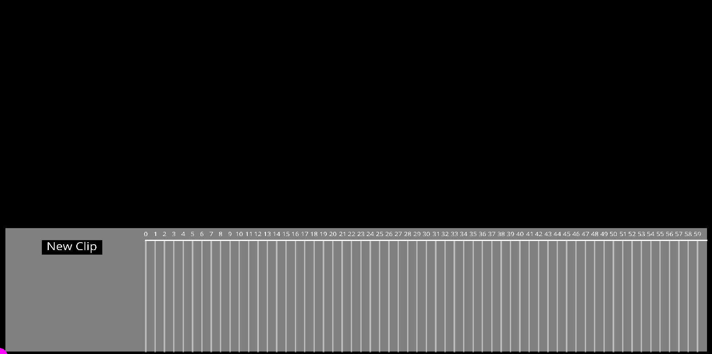

# Custom Engine

***

- Duration:             2 years
- Language:             C++
- Key words:            2D, OpenGL
- Time:                 Auguest 2022 - May 2024

***

This engine is developed over the course of two years through my learning times in SMU Guildhall guided by <a href="https://www.linkedin.com/in/squirreleiserloh/">Squirrel Esierloh</a> and <a href="https://www.linkedin.com/in/matthewabutler/">Matt Butler</a>. 

***

### Key features

1. C++ for windows games
2. Input: using WindowsMessage and XInput, I/O with std::filesystem
3. Rendering
    - DirectX11
    - OpengGL
    - 2D and 3D
4. Assets Loading
    - stb_imgage for picture files
    - 3D obj model files loaded with custom OBJ loader
    - using freetype and sign-distance-field for font loading and rendering
5. Physics
    - 2D physics supports overlap detection, pushing out, and raycast vs each one of them
        - Disc
        - AABB
        - OBB
        - Line 
        - Capsule
        - Plane
        - ConvexPoly
        - ConvexHull
    - 3D physics support raycast vs Cylinder
6. Multi-threading: using JobSystem to dispatch jobs for threads to work on, and later on be collected by main thread; Optimize art asset loading with multi-threading
7. DevConsole: out-of-box dev console using EventSystem to trigger commands
8. Tweening System: out-of-box keyframe animation editor that enables tweening motion edits, and save/load to disk

***



    Keyframe animation editor

