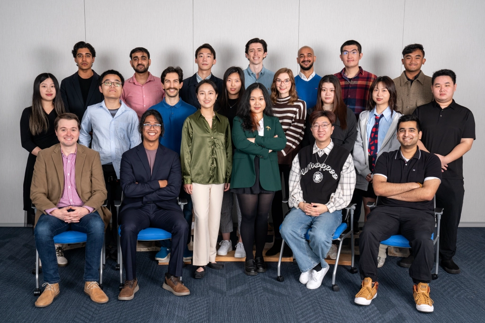

# Asurya's Embers

***



***

    
<a href="https://store.steampowered.com/app/2491710/Asuryas_Embers/">Steam Store Page</a>

***

- Duration:             6 months
- Team size:            22 (7 programmers)
- Platform:             Steam, Epic Game Store
- Engine:               Unreal 5.3
- Time:                 June 2023 - Decemeber 2023

***

Asurya's Embers is a bow-and-arrow game where you play as Dhawa the guardian of the village and trying to defeat the Sun God to save the village. On the way to the sun god, the player will need hide in the shadow and avoid damage from the sun, defeat enemies, and solve puzzles. This game features two boss fights, and three types of enemies, four types of arrows, parkour system, fully animated mordern first person shooter combat system, diagetic UI, save/load game system, and aim assist system. 

***

### Roles and Responsibility

1. Boss fight system for the dragon including: pathing, animation, AI, UI
2. Bow-and-arrow implementation such as camera management, animation FSM, input system, player movement
3. Audio system implementation using Unreal Metasound for footsteps, environment sound, and character voicelines
4. System architecture 
5. Store SDK relevant things like pushing builds to store, achievements, and overlays for Steam and Epic Game Store
6. UI Implementation and bug fixing
7. Level small puzzle implementations

***

1. Made with blueprint
2. 3 stages of boss fight that use different beahviour patterns
3. Created triggers and splines for boss designer to use in the editor
4. Used control rig and animation blueprint for animation
5. Used niagara to bring particle effects assets to dragon
6. Used behaivour tree for AI 

***



1. Implementing UI components from design
2. Solve input can not be recieved bug in UMG
3. Solve focus issues with UMG
4. Help build responsive UI icons to different controls scheme (keyboard/controller)

***

- Implementing Dragon Boss AI with behaviour tree
- Build architecture of Enemy class
- Finialize enemy classes APIs

***

- Help building the state machine for player control



- Set up initial tech design of the valuting system

***

### The Team

