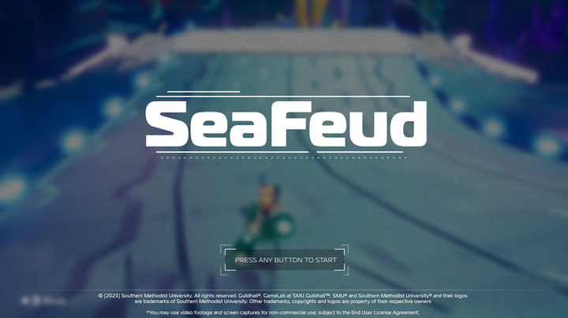
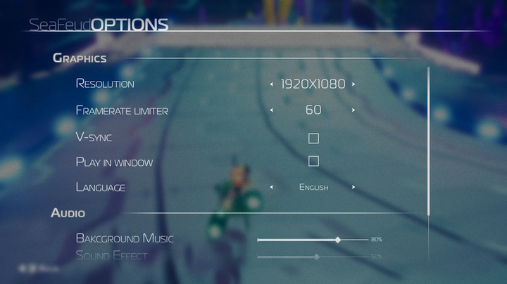
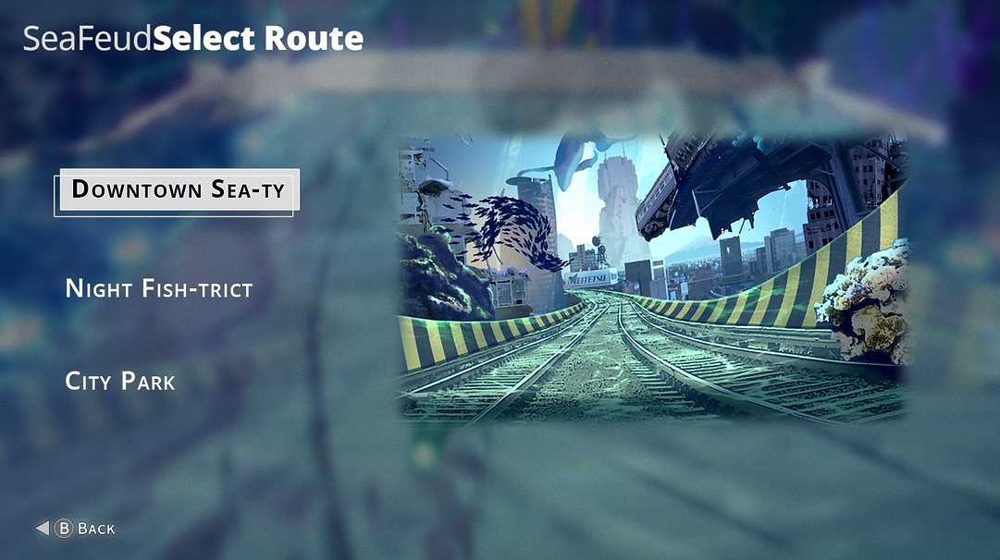
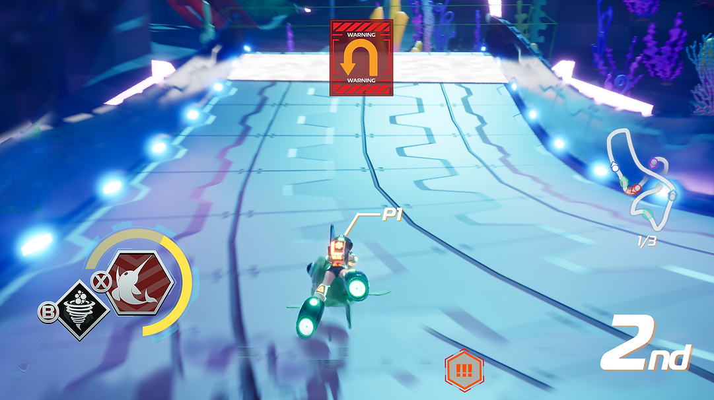

# Seafeud

***



***

    
<a href="https://store.steampowered.com/app/2322020/SeaFeud/">Steam Store Page</a>

***

- Duration:             3 months
- Team size:            48 (14 programmers)
- Platform:             Steam
- Engine:               Unreal 5.2
- Time:                 January 2023 - May 2023

***

SeaFeud is an underwater arcade racing game made by students at SMU Guildhall. Players race on fish and dynamically change their “vehicle” stats by colliding and swapping with other fish on the course. While in typical racing games, players select their vehicle or customize their vehicle prior to starting the game, SeaFeud switches things up by defaulting everyone to a basic fish at the beginning of the race. Throughout the race, the player can swap to other fish, giving them a statistical edge. While on these fish, their stamina will run down before swapping back, encouraging the player to try different playstyles.

***

### Roles and Responsibility

1. Setup and maintain the workflow of editor tools such Multi User Editing and sublevels for Level Designers
2. Setup and maintain the automation pipeline of server nightly builds and steam builds
3. Setup and maintain perforce and structure of project
4. UI menus such as splash, main menu, and options
5. Debug and fix blueprint bugs and performance issues

***

1. Implementing the landing menu, and settings menu
2. Contribute to Common UI input issues in the multiple player select menu
3. Help with implementing the player item and charge meter in player HUD

***

### The Team (Programmers)

