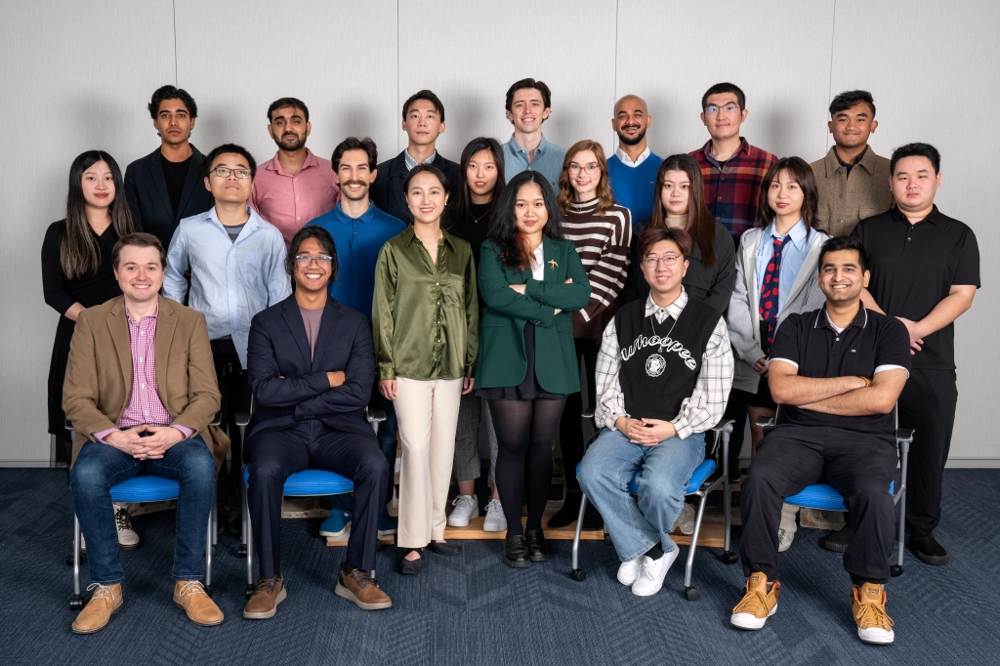

# Asurya's Embers

***



***

- Duration:             6 months
- Team size:            22 (7 programmers)
- Platform:             Steam, Epic Game Store
- Engine:               Unreal 5.3

***

Asurya's Embers is a bow-and-arrow game where you play as Dhawa the guardian of the village and trying to defeat the Sun God to save the village. On the way to the sun god, the player will need hide in the shadow and avoid damage from the sun, defeat enemies, and solve puzzles. This game features two boss fights, and three types of enemies, four types of arrows, parkour system, fully animated mordern first person shooter combat system, diagetic UI, save/load game system, and aim assist system. 

***

### Roles and Responsibility

1. Boss fight system for the dragon including: pathing, animation, AI, UI
2. Bow-and-arrow implementation such as camera management, animation FSM, input system, player movement
3. Audio system implementation using Unreal Metasound for footsteps, environment sound, and character voicelines
4. System architecture 
5. Store SDK relevant things like pushing builds to store, achievements, and overlays for Steam and Epic Game Store
6. UI Implementation and bug fixing
7. Level small puzzle implementations

***

### The Team

