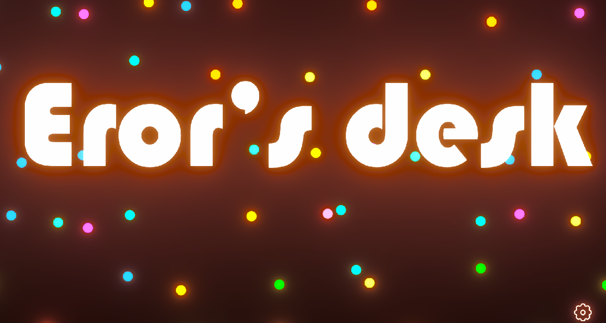

# Personal work

## Pan's Survivor Chess

captured during development phase

self-drawn art assets

### Description

This project is made during the summer term of SMU Guidlhall program. Roughly 90 hours were put into this project while 4 other classes were going. The general idea of this game is that it is a blend of vampire survivor and auto chess. Players can buy units from the shop to defend the core and player lose if the core ran out of health. Units can upgrade if collected 3 of the same units, and can upgrade twice. Units are also have different tiers that higher tier units can only be acquire form higher tier shop

### Features

1. UI of a typical auto chess game such as Shop, Bench, and grid-like field
2. The match 3 to upgrade unit mechanic from auto chess game
3. Projectile-based combat system 
4. Purely data driven meaning every unit, enemies, and weapon is created from the XML file
5. Bond active effect based on field units mechanic from auto chess game
6. Infinite enemy waves from vampire-survivor-like games

## Eros's Desk

### Description

Eros's Desk, as the name suggests, this project is a simulation of the connectivity of human relationship and how our life are entangled with one another in a top-down view resembles how it would look like at the office desk of the god of love, and it is created for Creative Computing Capstone at Southern Methodist University using Unity

1. Each unit(circle thing) are differentiate by their personality in the form of their color
2. They will flow around in the space, and each interaction (bumping into one another) cause them to be affect by the other unit
3. These impacts to them and changes how they interact with other units
4. They can be tell by the inner flowing-snakey things inside the circle
5. Units can form 3 types of relationship: Friend, Family, and Enemy (differentiate by link color: green, gold, and red)
6. Units have limited lifetime, and new units will be spawned with inherited values from their parent
7. Shift of time can be tell by the seasonal changes from summer to winter in the form of red tone to blue tone
8. Units that have positive relationship are more likly to more together, and negative relationship repell them

### Link

[Itch.io](https://yimingp.itch.io/erors-desk)  
[Github](https://github.com/yimingp/Eros-s-Desk)  
