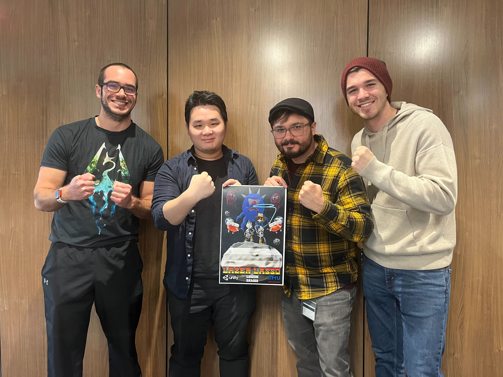

# Team Projects

## TGP3 
>Description of the game goes here
> 
>The trailer goes here
> 
>Roles and responsibility goes here
> 
>Things learned goes here
> 
>link to steam page goes here

## Seafeud
>Description of the game goes here
> 
>The trailer goes here
> 
>Roles and responsibility goes here
> 
>Things learned goes here
> 
>link to steam page goes here

## Lazer Lasso

### Overview

Lazer Lasso is a 2D platformer game designed for android tablets and made with Unity. As Lazer Lasso, our main character, your goal is to swing from asteroid-to-asteroid and attack the alien varmints that have stolen your beloved space-cows. 

### Trailer

    <iframe width="420" height="315" src="https://www.youtube.com/watch?v=OE0LleweNZQ&ab_channel=NikolaiGeldehyrde">
</iframe>

### The Team

### Roles And Responsibility

My role was being the solo programmer that handles everything programming or software related. 
