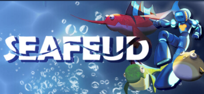

# Team Projects

## Seafeud

### Overview

SeaFeud is an underwater arcade racing game made by students at SMU Guildhall. Players race on fish and dynamically change their “vehicle” stats by colliding and swapping with other fish on the course. While in typical racing games, players select their vehicle or customize their vehicle prior to starting the game, SeaFeud switches things up by defaulting everyone to a basic fish at the beginning of the race. Throughout the race, the player can swap to other fish, giving them a statistical edge. While on these fish, their stamina will run down before swapping back, encouraging the player to try different playstyles

### Roles and Responsibility

1. Setup and maintain the workflow of editor tools such Multi User Editing and sublevels for Level Designers
2. Setup and maintain the automation pipeline of server nightly builds and steam builds
3. Setup and maintain perforce and structure of project
4. Trivial UI menus such as splash, main menu, and options
5. Debug and fix blueprint bugs and performance issues

### Trailer

      <video width="500" height="230" src="videos/Seafeud_Trailer.mp4" data-canonical-src="videos/Seafeud_Trailer.mp4" controls="controls" muted="muted">

### The Team

Size of roughly 48 people: 4 producer, 10 artist, 15 programmer and 19 level desingers

This is a photo of the programmer team

## Lazer Lasso

### Overview

Lazer Lasso is a 2D platformer game designed for android tablets and made with Unity. As Lazer Lasso, our main character, your goal is to swing from asteroid-to-asteroid and attack the alien varmints that have stolen your beloved space-cows

### Roles And Responsibility

My role was being the solo programmer that handles everything programming or software related

1. Designed and mplemented the grappling hook with script overrides to the Unity joint system, and working with level designers closely to really tunning down the feel of the "lasso" (grappling hook)
2. Created prefabs for level designers to build their levels
3. Created the UI with native Unity UI system, having features such as level select, win/lose window, settings menu, tutorial pop-up, dialouge window, and embedded videos
4. Bug fixing rapidly whild building new features within 135 hours of development
5. Integrating Unity to android platform, avoid and solve risks of performance issues

### Trailer

      <video width="500" height="230" src="videos/LazerLasso_Trailer.mp4" data-canonical-src="videos/LazerLasso_Trailer.mp4" controls="controls" muted="muted">

### The Team

From left to right : Nicholas, Me, Nick, Matt

